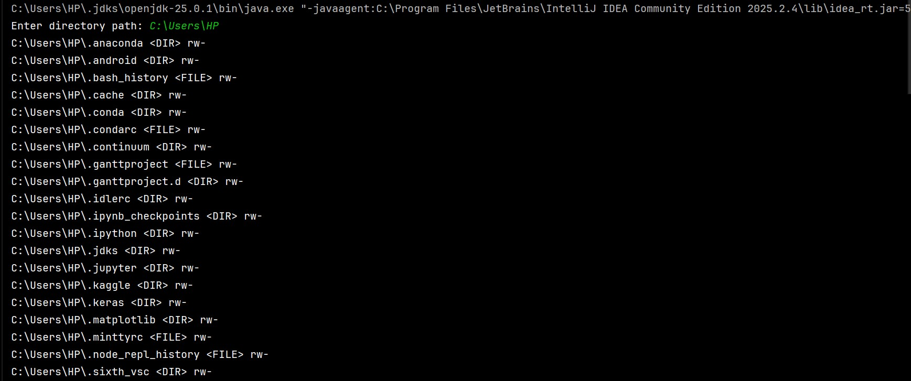
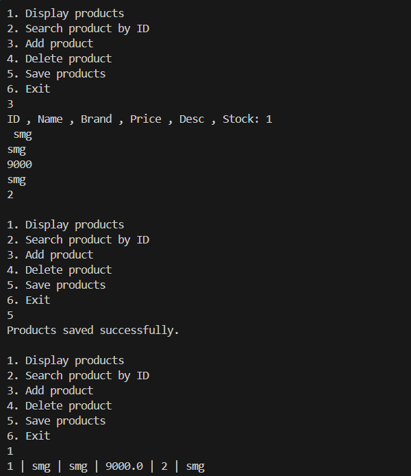
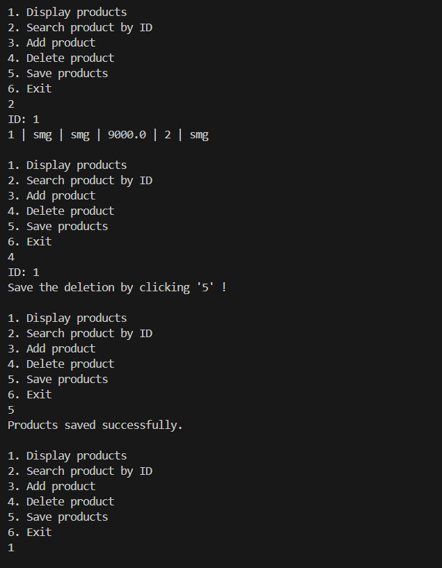
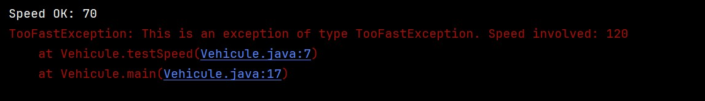

# 📘 Compte Rendu – TD Java

## Input / Output & Exception Handling

* **Student:** Mustapha Elmifdali
* **Class:** SDIA1
* **Subject:** Object-Oriented Programming (OOP) & Java

---

## 📌 Overview

This repository contains solutions for **Java TD exercises** focusing on:

* File and directory manipulation (Input / Output)
* Object serialization
* Exception handling (standard and custom exceptions)

Each exercise is implemented following **OOP principles**, with clear structure, documentation, and execution screenshots.

---

## 🧪 Part 1: Java Input / Output Practice

### 🔹 Exercise 1 – Simulating the `ls` Command

#### 📝 Objective

Develop a Java program that simulates the Linux `ls` command by displaying the contents of a directory, including file type and access permissions.

#### 🛠️ Implementation Details

* Used the `File` class to access directories and files
* Read the directory path from user input
* Identified file types using:

  * `isFile()`
  * `isDirectory()`
* Displayed permissions using:

  * `canRead()`
  * `canWrite()`
  * `isHidden()`
* Printed:

  * Absolute path
  * Type (`<FILE>` or `<DIR>`)
  * Access permissions

#### 📸 Execution Screenshot

---

### 🔹 Exercise 2 – Product Management with Object Serialization

#### 📝 Objective

Create a product management system that allows:

* Adding products
* Displaying products
* Searching by ID
* Deleting products
* Saving and loading products using serialization

All data is stored in a file named **`products.dat`**.

#### 🛠️ Implementation Details

* Created a `Product` class implementing `Serializable`
* Defined an interface `IProduitMetier` for business logic
* Implemented the interface in `MetierProduitImpl`
* Used:

  * `ObjectOutputStream` to save products
  * `ObjectInputStream` to load products
* Implemented a **menu-driven console application**

#### 📸 Execution Screenshots

***Main Menu & Add Product & Save Operations ***

***Search, Delete Product & Product List Display***

---

## ⚠️ Part 2: Exception Handling Practice

### 🔹 Exercise 1 – Calculator with Exception Handling

#### 📝 Objective

Create a calculator that safely performs arithmetic operations while handling common runtime errors.

#### 🛠️ Implementation Details

* `divide(a, b)` method with division-by-zero protection
* `convertToNumber(String text)` using `try/catch`
* `calculate(operation, a, b)` implemented using `switch`
* User-friendly error messages for:

  * Invalid numbers
  * Unsupported operations

> 📌 *No execution screenshots required for this exercise.*

---

### 🔹 Exercise 2 – Custom Exception: Speed Control System

#### 📝 Objective

Detect when a vehicle exceeds a speed limit using a **custom exception**.

#### 🛠️ Implementation Details

* Created `TooFastException` extending `Exception`
* Implemented a `Vehicule` class with `testSpeed()` method
* Exception thrown when speed exceeds **90 km/h**
* Exception handled in `main` with `printStackTrace()`

#### 📸 Execution Screenshot

---

## ✅ Conclusion

This TD helped reinforce key Java concepts such as:

* File manipulation and directory handling
* Object serialization and persistence
* Interface-based design
* Exception handling and custom exceptions

The exercises were implemented following clean code practices and Object-Oriented Programming principles.

---

📚 **End of Compte Rendu**
